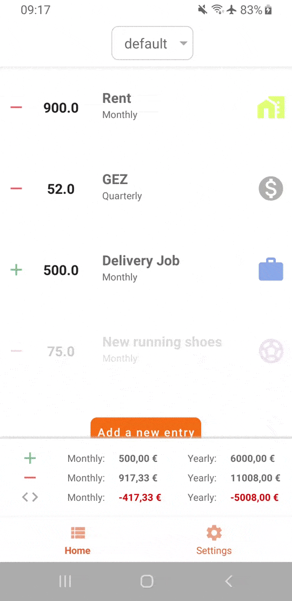
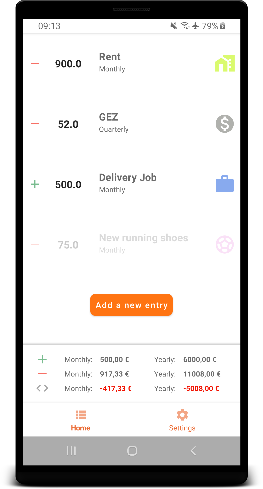
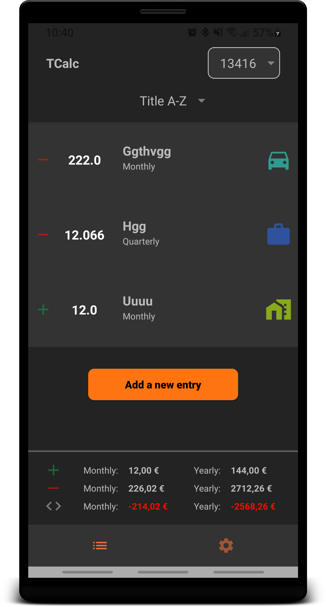
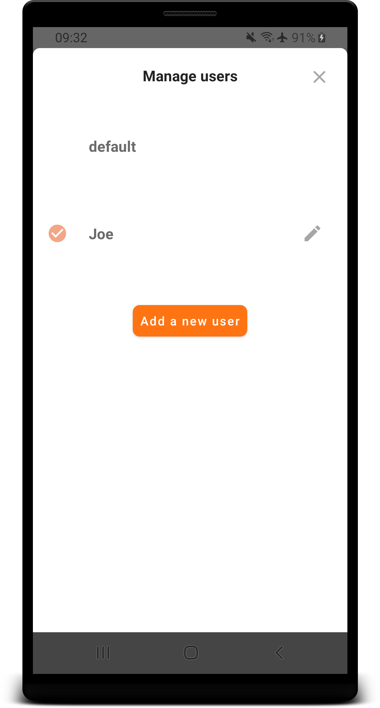
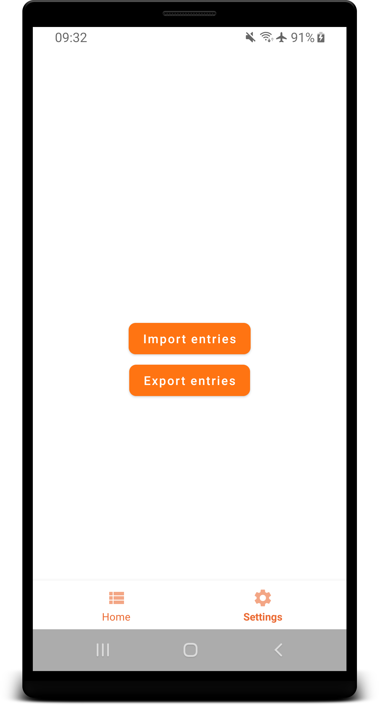

<h1 align="center">
    TCalc
</h1>

<a href="#setup">Setup</a> •
<a href="#architecture">Architecture</a> •
<a href="#contribute">Contribute</a> •
<a href="#licensing">Licensing</a>

This is a small app offering the capability of showing the monthly costs a user can define for him with a list of items which define an output or an income per month/quarterly/yearly.

This app is made completely for offline use due to the nature of the very personal data a user can enter and save. It uses a device owned database. It is possible to create several users and share them through an import and export feature which generates a human readable CSV-file.

## Screens

## Setup
This app is based on android "jetpack" and architecture components and uses gradle 4.10.1.+
This means that at least `Android Studio 3.3` should be used for successful builds.

`Kotlin` is used as the main language of this project.

## Testing
This project offers **unit tests** with the use of the [roboelectric](http://robolectric.org/)-framework. These unit tests can be found in `test..roboelectric`. It can be used for testing android mocked capabilities of the app such as importing and exporting files. Instrumented tests are found under `androidTest` for pure UI-testing.

## Architecture
To accelerate development and testability, a `Model-View-ViewModel (MVVM)` approach with android [architecture components](https://developer.android.com/jetpack/arch/) and [databinding](https://developer.android.com/topic/libraries/data-binding/) is used. Base classes for viewModels and fragments give a structure to build upon. `LiveData<>` is used in conjuction with Databinding for updating activities and fragments with their corresponding `lifecycle`.

Business logic will mainly be implemented in `viewModels`. Only certain callbacks will need activities or fragments.

- Heavily relies on Jetpack libraries for example for [navigation](https://developer.android.com/jetpack/androidx/releases/navigation) and [architecture components](https://developer.android.com/topic/libraries/architecture)
- As a dependency injection framework, for clear seperation of concerns and easy testability of business logic, this project uses [Hilt](https://dagger.dev/hilt/) based on dagger
- The current implementation of the database is provided by [Room](https://developer.android.com/topic/libraries/architecture/room)
- Uses [RxJava](https://github.com/ReactiveX/RxJava)) and the **Repository** pattern for accessing data streams.

## Linting
The [detekt](https://github.com/arturbosch/detekt) plugin is used for kotlin linting. Usage: `./gradlew detektCheck`

## Javadoc / KDoc
Javadoc or KDoc generation can be triggered via the [dokka](https://github.com/Kotlin/dokka) plugin. Usage: `./gradlew dokka`

## Contribute
Contribution and feedback are always welcome.
Please work in your own branch (`work/your_feature`) and make a Merge-Request. After the request is reviewed and an approval has been given, the code changes can be merged into the defaulting `stable` branch.

## Licensing

Copyright (c) 2020 Thomas Hofmann.

Licensed under the **Apache License, Version 2.0** (the "License"); you may not use this file except in compliance with the License.

You may obtain a copy of the License at https://www.apache.org/licenses/LICENSE-2.0.

Unless required by applicable law or agreed to in writing, software distributed under the License is distributed on an "AS IS" BASIS, WITHOUT WARRANTIES OR CONDITIONS OF ANY KIND, either express or implied. See the [LICENSE](./LICENSE) for the specific language governing permissions and limitations under the License.
