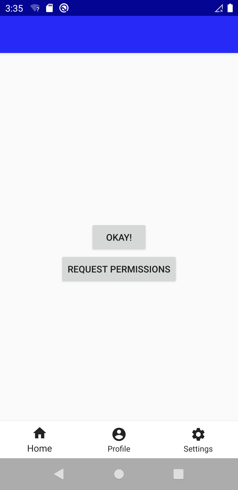
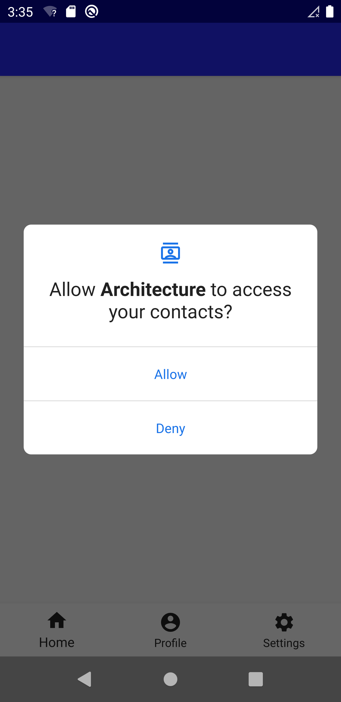
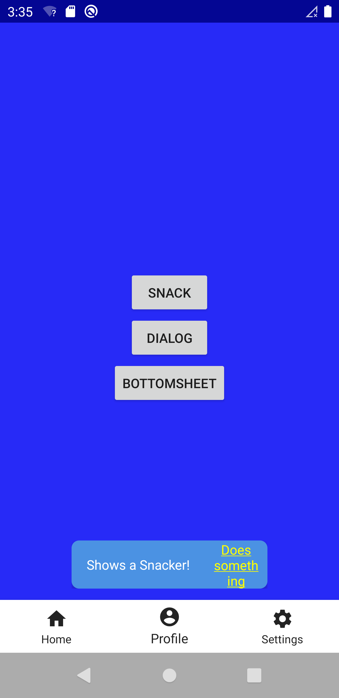
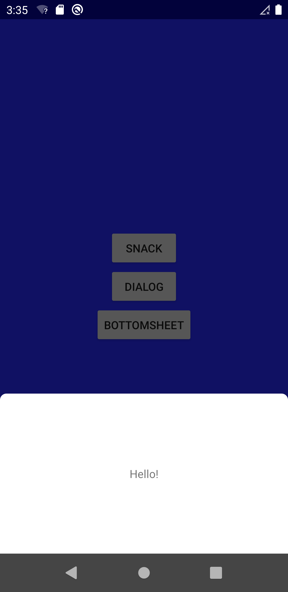
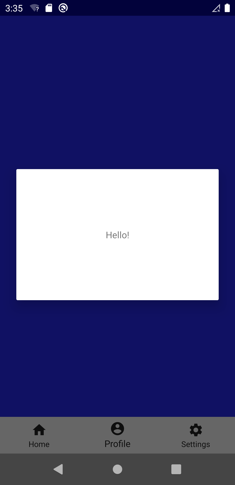
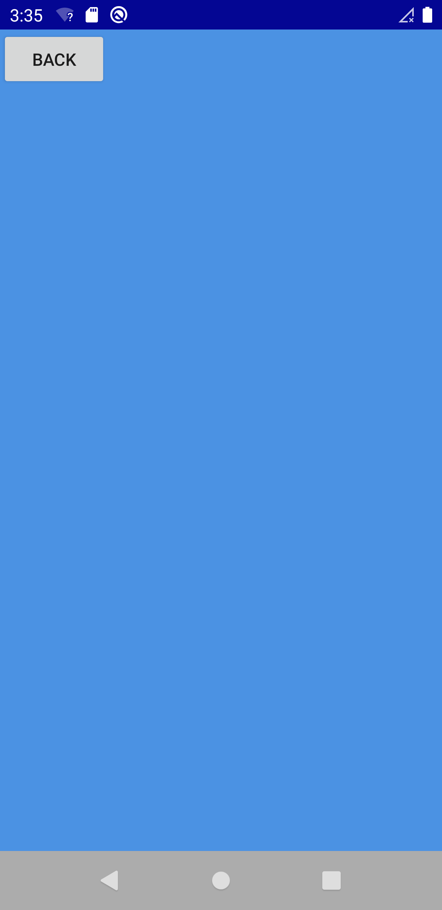
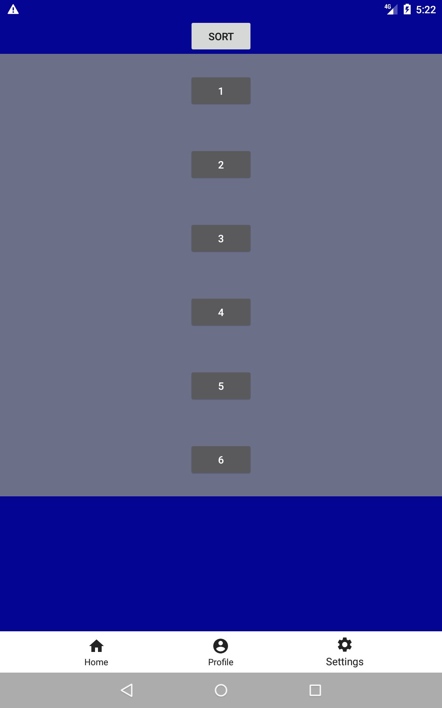
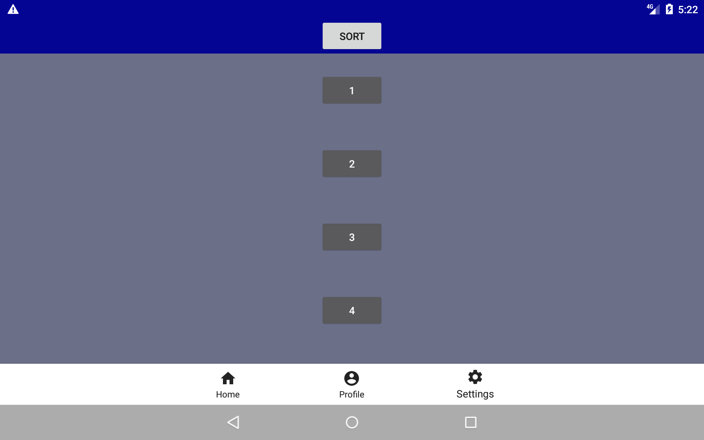
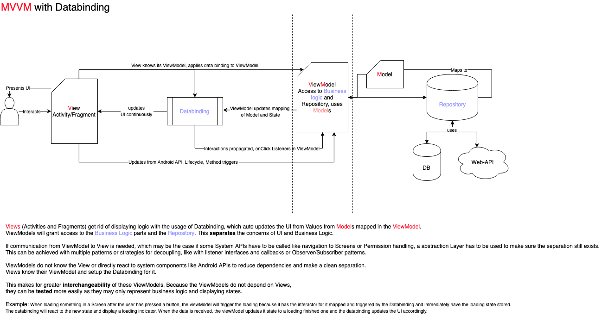

<h1 align="center">
    JamitLabs Architecture Example
</h1>

<a href="https://git.jamitlabs.net/android-samples/architecture-example/-/releases">Changelog</a> •
<a href="#setup">Setup</a> •
<a href="#architecture">Architecture</a> •
<a href="#contribute">Contribute</a> •
<a href="#licensing">Licensing</a>

The main purpose of this sample app is representing functionality of a simple architecture.

It evolved to a simple app showing a bottom navigation bar taken from the google design library with different tabs.

There is a database and web api abstraction which automatically can download a json response in the
background, save it to a database and load it, if offline/ on error. These things are hidden in the
background. Please discover the repo for further info.

**It has does in no means claim to have optical highlights and just demonstrates the tech behind it**

## Screens

 
 
 

## Setup
This app is based on android "jetpack" and architecture components and uses at least Gradle 4.10.1
This means that at least `Android Studio 3.3` should be used for successful builds.

`Kotlin` is used as the main language of this project.

## Architecture

To accelerate development and testability, a `Model-View-ViewModel (MVVM)` approach with android [architecture components](https://developer.android.com/jetpack/arch/) and [Databinding](https://developer.android.com/topic/libraries/data-binding/) is used. Base classes for viewModels and fragments give a structure to build upon. `LiveData<>` is used in conjuction with Databinding for updating activities and fragments with their corresponding `lifecycle`.

Business logic will mainly be implemented in `viewModels`. Only certain callbacks will need activities or fragments.

**Note** that it is a good/common practice to not put any android framework code into the viewModels at all, to not
let a viewModel directly know all ids of the view they are updating and especially, not leak the context. This makes viewModels exchangeable and independent of android apis to have easier unit tests.
 In this approach, viewModels are allowed to use a limited abstraction set of android framework functions via injection of a `ResourcesProvider`.
 Furthermore, it can start a navigation event simply for a quicker development experience, however, a viewModel is still not allowed to really "know" the views they are updating to make them interchangeable at any time.

Use Koin for `Dependency Injection`.

The api is consumed using `Retrofit` and `RxJava`. Storing data is done with `ObjectBox`.

### Component communication
To get rid of a complex and hard to read listener/callback implementation scheme, in this app components can freely
communicate with each other using a event system consisting of **two different types** with a observer/subscriber
pattern:

### 1. Events sent via viewModels using `QueueLiveEvents`.
These events can used to safely communicate **from ViewModel to its Fragment or Activity** and will always have only the
one component as a observer.
As fragments and activities can easily tell their viewModel what and when to do something, viewModels normally can't
reply to them.
  *Note that this is absolutely intentional!*
  As the viewModels could otherwise not be exchangeable AND may not be lifecycle aware and therefore inform a
  inactive/stopped component about changes which may then be processed and results into at least bad experience
  or battery life when the user did already bring the app to the background for example or the fragment/activity fails
  to process it.

  There are some predefined Events which can be used from viewModel to Fragment and much more from viewModel to
  Activity. Naturally these are shortcut events for easier navigation and opening activities or jumping to fragments
  more easily. Just go into the base classes and check which Events the component is listening to.
  For convenience there is a `handle<*>` method which will take any data class as parameter.
  To make it easier for daily development, it should only be needed to use the methods for handling events provided
  by the BaseViewModel. Only add new events to the BaseViewModel if absolutely necessary and rely on the handle(element:
   T) method of said viewModel.

### 2. Events sent through RxJava.
These events can be fired from **everywhere and observed when ever needed**. This is useful for global wide events which
could be a login/logout of a user for example and multiple observers. So the main difference to the 1. is that this kind of communication is not lifecycle aware and can and should be processed even if no UI is showing or ready for it. A result of it can be saved to a `MutableLiveData` inside a ViewModel which later may update a UI.
As these events can be transmitted any time, fragments or activites should not listen to such events. Use their
viewModels instead and process any important features there. If the view still needs a callback, use 1. to forward it.

### 2.1 Events sent via coroutines.
The branch `coroutines` is a new approach to the event system and handling retrofit calls. You can check it out and test it for yourself. In this branch, Rx is removed completely and only coroutines are used.

### What are the biggest differences compared to the original google approach?

The JamitLabs architecture does not only use viewModels for abstractions to data stored in `LiveData` processed in them with Repositories as data sources but also **maps this data to be ready to be used for presentation logic.** The databinding library then gets notified about changes in this data and changes the view according to it.

Sam applies for interactions with the view which trigger data changes; these listeners are also implemented inside the viewModel.
This has some *benefits*:

- We have (almost) no presentation logic inside fragments and activities, as everything can be auto updated by the databinding and the mapping of viewModels or with the help of binding adapters. Giving viewModels the responsibility to connect presentation and business logic and making views only display it gives a **clear separation of concerns**.
- UI mappings with databinding need less boilerplate and/or view Code and nesting than updating UI inside a Fragment or Activity after observing data.
- **Testing** a viewModel not only applies for the data changes but can also test presentation logic.
- Shared ViewModels across different screens even have more possibilities to share state because they offer ui mappings.

*Drawbacks* which can be diminished:

- It is the responsibility of the developer to **still make the viewModel not know the view,** to make the viewModel for a specific view still exchangeable. This may sound a bit strange at first because it can handle presentation logic, but this logic is only the mapping - for example setting a visibility for a specific content, while data is loaded. But there should be no problem at all with it, as it is only a information, that views could react to this.
- Logic inside xmls of databound layouts in conjunction with viewModels tear down the clear sepearation of concerns and make maintaining and exchanging viewModels extremely hard; this is why we have the convention to only add viewModels with **no other logic than setters and getters inside the xmls.**

*Pitfalls*:

- Sometimes it is not so easy to rely simply on data mappings with databinding; in case of animations it can seem a bit cumbersome to trigger on viewModel events. In some cases it might then be advisable to trigger it directly in the view or Activity/Fragment.
- Because this is not the original viewModel approach from google, where the viewModel events are always observed in the Fragment or Activity and the UI is updated there, the learning curve may be a bit steeper to clearly separate the viewModel mappings from direct view manipulation.

### Navigation
The app should consist of few activities as possible. A single activity will handle all main navigational events with fragments. Only certain detailed views or modules should need their own activity.

### Passing data between fragments and fragments and dialogs
This architecture uses a new approach for *passing data (as bundles) from fragment to fragments or dialogs to fragments* (as they are in their base fragments). This is made possible with the use of recent changes in `androidx.fragment` library (1.3.0-+).

To make this work you need to understand the concept of the fragment which wants a result from another fragment, we call it `FragmentResultable` and the fragment/dialog which sets the result. Each fragment can listen for results from another fragment, to match each other, they need a key (String) to be identified which must be equal.

Apply the Interface `FragmentResultable` to the fragment, which wants to receive results from another fragment, which automatically offers the methods to receive the result and to set the key.
You now only have to set a result in a fragment/dialog. This is as simply as calling `setFragmentResult(resultRequestKey, resultBundle)` or as a convenience in dialogs `dismissDialogWithResult` which also dismisses the dialog.

## Main Libraries
* Databinding library
* Android architecture components
* Jetpack navigation framework
* KTX, android kotlin-extensions
* Koin dependency injection
* Leak Canary to detect memory leaks at runtime (only built in debug mode)

* Retrofit for networking
* ObjectBox for storing data
* RX: Java, Kotlin, Android for background work and decoupled events

## Restrictions
Currently there are no restrictions.

## Linting
The [detekt](https://github.com/arturbosch/detekt) plugin is used for kotlin linting. Usage: `./gradlew detektCheck`

## Javadoc / KDoc
Javadoc or KDoc generation can be triggered via the [dokka](https://github.com/Kotlin/dokka) plugin. Usage: `./gradlew dokka`

## Contribute
Contribution and feedback are always welcome.
Please work in your own branch (`work/your_feature`) and make a Merge-Request. After the request is reviewed and an approval has been given, the code changes can be merged into the defaulting `stable` branch.

## Licensing

Copyright (c) 2020 JamitLabs GmbH.

Licensed under the **Apache License, Version 2.0** (the "License"); you may not use this file except in compliance with the License.

You may obtain a copy of the License at https://www.apache.org/licenses/LICENSE-2.0.

Unless required by applicable law or agreed to in writing, software distributed under the License is distributed on an "AS IS" BASIS, WITHOUT WARRANTIES OR CONDITIONS OF ANY KIND, either express or implied. See the [LICENSE](./LICENSE) for the specific language governing permissions and limitations under the License.
